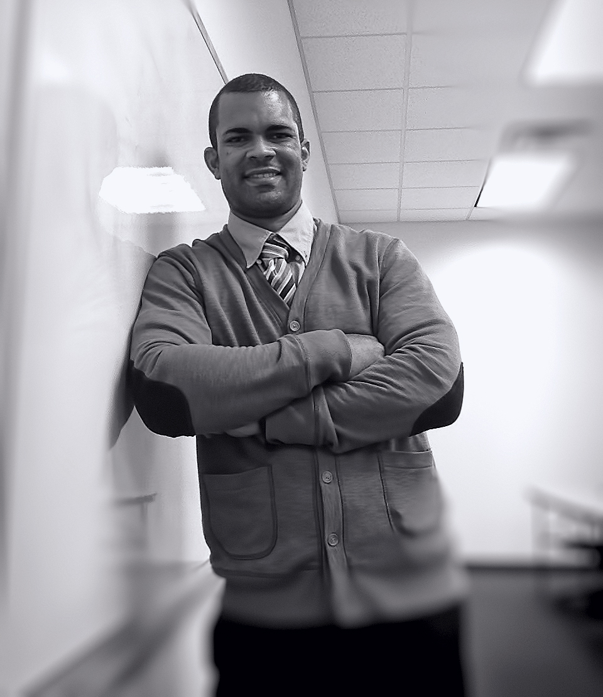

## Our Mission

Our main scientific goal is to provide further insight into the immuno-physiological health effects that airborne pollutants of different chemical origins induce once they cross the human respiratory barrier among susceptible individuals (e.g. people suffering from asthma, respiratory allergies, and other chronic respiratory conditions). We seek to address our scientific questions by integrating human-based immuno-physiological approaches, molecular biology, and computational biology.

 

The RIPL Effect research team also serves as a venue for the core of the team, <strong>our researchers (current and former graduate students)</strong>, to carry out high-quality scientific research and exemplify:

- **Inclusiveness** (everyone’s voice count)
- **Multi-disciplinary** focus (integrate different disciplines into our reach goals)
- **Diversity** (value and respect differences in perspectives and opinions)
- **Integrity** (follow strict institutional, scientific, and ethical guidelines)
- **Productivity** (input our highest efforts to reach our goals)
- **Innovation** (remain open-minded, and will learn from both successes and failures)
- **Excellence** (target the highest quality of scientific research)
- **Collaboration** (what is done in isolation is often accomplished better in partnership)
- **Leadership** (nourish from a culture of intra and inter-motivation and inspiration)

## Team Members

***Current members of the RIPLRT***

- [Dr. Félix E. Rivera-Mariani (**Principal Investigator**)](#Dr. Félix E. Rivera-Mariani)
- [Ariel Stateman](#Ariel Stateman)
- [Hayat Srour](#Hayat Srour)
- [Joshua Baguley](#Joshua Baguley)
- [Shandra Bellinger](#Shandra Bellinger)

 ***Dr. Félix E. Rivera-Mariani*** (**Principal Investigator**): 

Dr. Rivera-Mariani, Assistant Professor and Academic Director in the <a href="http://ularkin.org/college-of-biomedical-sciences/" target="_blank">College of Biomedical Sciences at Larkin University</a>, is an expert immunologist, microbiologist, aerobiologist, and computational biologist. At Larkin University, Dr. Rivera-Mariani, in addition to carrying out scientific research, teaches biochemistry, immunology, and molecular genetics. Among the academic credentials of Dr. Rivera-Mariani include a B.S. in Biology with a minor in Chemistry (Southeastern Louisiana University under an athletic scholarship), Ph.D. in Microbiology and Medical Zoology (School of Medicine of the University of Puerto Rico - Medical Sciences Campus), post-doctoral fellowship in Environmental Health Sciences (the Bloomberg School of Public Health of the Johns Hopkins University), and Science Teaching Fellowship (American Society for Microbiology).

 

Dr. Rivera-Mariani is also a strong supporter of reproducibility in sciences and thus has gained specializations in Data Science, Genomic Data Sciences, Executive Data Science, Software Development (Johns Hopkins University), Systems Biology (Icahn School of Medicine at Mt. Sinai), and Bioinformatics (University of California at San Diego). Through these specializations, Dr. Rivera-Mariani has developed extensive experience as a programmer in the R, Python, and Matlab computer languages.

 

At Larkin University, Dr. Rivera-Mariani seeks to mentor students and young researchers in the different pipelines and epicycles of scientific research, and through the RIPL Effect team provide further insight into the immunotoxicology of airborne pollutants of different chemical origins. He has published extensively in this line of research (<a href="https://www.researchgate.net/profile/Felix_Rivera-Mariani/publications" target="_blank">click here for additional information</a>).

 

 ***Ariel Stateman*** (**Research Assistant**)

Ariel recently graduated from the M.S. in Biomedical Sciences program at Larkin University. Before joining Larkin, Ariel earned a B.S. in Molecular and Cellular Biology from the University of Illinois at Urbana-Champaign. There, she participated in scientific research- studying the sensing in lean and obese individuals through rats. She has an extensive experience in clinical observations from her internships at Carle Foundation Hospital in Urbana, IL. Among her prospective professional plans, she hopes to earn her doctorate degree.

 ***Hayat Srour*** (**Research Assistant**)

Hayat, from Detroit, Michigan, is also a graduate from the M.S. in Biomedical Sciences program at Larkin University. Before joining Larkin, she earned a B.A. in Anthropology from Wayne State University (Detroit, Michigan). Her interest in scientific research stems from her passion for medicine and philanthropy. Among her diverse goals, she aspires to become a physician that actively works toward global equality.

 ***Joshua Baguley*** (**Research Assistant**)  

Josh grew up in Indonesia and then moved to Waco, Texas where he attended Baylor University to complete a B.S. in Biochemistry. He spent the majority of his time at Baylor working as an undergraduate researcher, specializing in DNA manipulation and protein purification. His work in the lab mainly focused on the functions and effects of replication factors MCM8, MCM9, Dpo1, and Dpo4 on the DNA replisome. Joshua was also a member of the Baylor Volleyball club team. Joshua is also a recent graduate of the M.S. in Biomedical Sciences program at Larkin University.

 ***Shandra Bellinger*** (**Research Assistant**)

Shandra, originally from Maryland, received her B.S. in Biology from Frostburg State University. During her undergraduate studies, she held multiple positions on various leadership boards and made the Dean's list numerous times. She has spent a considerable amount of time working in clinical environments, such as the Emergency Department and volunteering at the University of Maryland Medical Center, Shock Trauma. Though she enjoys the clinical environment, she is excited to venture into scientific research allowing her curiosity of how the human body works and is affected. She recently graduated from the M.S. in Biomedical Science program at Larkin University and plans to continue working and volunteering in the healthcare field to help uplift the community and make changes where and when it’s possible. Her goal is to attend Medical School in the future.

  

---
***Past members of the RIPLRT***

---

***Interviews with current and past members of the RIPL_Effect***

#### With Dr. Félix E. Rivera-Mariani
<iframe width="560" height="315" src="https://www.youtube.com/embed/T7H_Q4WBYfI" frameborder="0" allow="autoplay; encrypted-media" allowfullscreen></iframe>

#### With Angel Jordan and Josh Baguley
<iframe width="560" height="315" src="https://www.youtube.com/embed/IUdQuzNDHQM" frameborder="0" allow="autoplay; encrypted-media" allowfullscreen></iframe>

#### With Jennifer Sutton and Roghan Wagimin
<iframe width="560" height="315" src="https://www.youtube.com/embed/_LODr7eC-M8" frameborder="0" allow="autoplay; encrypted-media" allowfullscreen></iframe>

#### With Melany Santana
<iframe width="560" height="315" src="https://www.youtube.com/embed/-UwbPcKTLZs" frameborder="0" allow="autoplay; encrypted-media" allowfullscreen></iframe>

#### With Ruslan Fomenko and Hayat Srour
<iframe width="560" height="315" src="https://www.youtube.com/embed/Zty6LdeTwbM" frameborder="0" allow="autoplay; encrypted-media" allowfullscreen></iframe>

#### With Shandra Bellinger
<iframe width="560" height="315" src="https://www.youtube.com/embed/72P1H5ioGrg" frameborder="0" allow="autoplay; encrypted-media" allowfullscreen></iframe>

---
**To contact us**, 
<a href="mailto:contactus@riplrt.com" target="_blank" style="color:#515151;"><i class="fa fa-envelope" style="font-size:1em"></i> &nbsp; click here to contact the RIPL_Effect Research Team. </a>

<a href="https://www.riplrt.com/"><strong>Click here to return to the Home Page</strong></a>.

&#169; 2018 RIPL_Effect Research Team. <i>The content of this website is authored by the RIPL_Effect Research Team, and is revised and edited by the RIPL_Effect Research Team. The content of this website reflect the views of the authors and is not a publication of Larkin University, which bears no responsibility for the content found in this website</i>.
